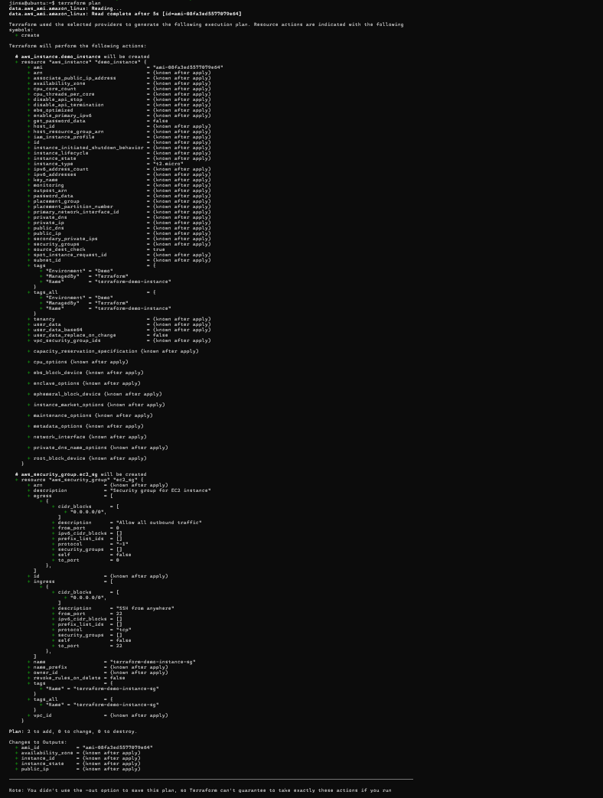
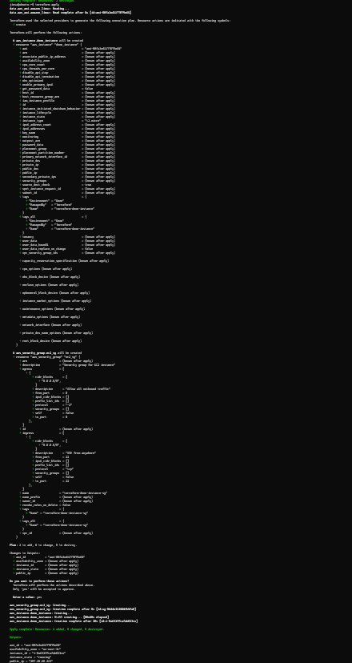
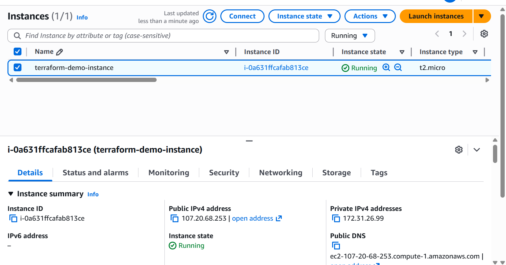
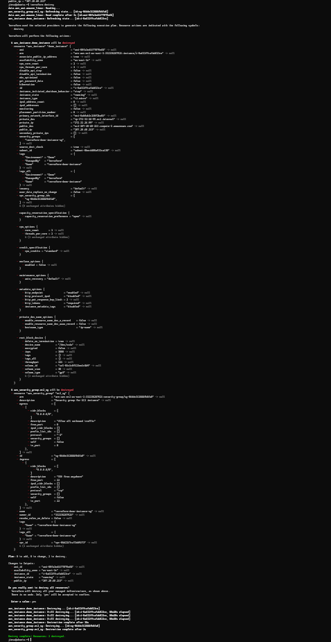

# Terraform AWS EC2 Instance Demo


A complete Terraform project to create, manage, and destroy an AWS EC2 instance.

## 📁 Project Structure

```
terraform/
├── main.tf           # Main Terraform configuration
├── variables.tf      # Input variables
├── outputs.tf        # Output values
├── .gitignore        # Git ignore rules
└── screenshots/      # Documentation screenshots
```

## 🎯 What This Creates

- **EC2 Instance**: Amazon Linux 2023, t2.micro (Free Tier eligible)
- **Security Group**: Allows SSH access on port 22
- **Automatic AMI**: Uses latest Amazon Linux 2023 AMI

## 🔧 Configuration

### Variables (with defaults)

| Variable | Description | Default |
|----------|-------------|---------|
| `aws_region` | AWS region | `us-east-1` |
| `instance_type` | EC2 instance type | `t2.micro` |
| `instance_name` | Name tag for instance | `terraform-demo-instance` |

### Outputs

- `instance_id` - The EC2 instance ID
- `public_ip` - Public IP address
- `availability_zone` - AZ location
- `ami_id` - AMI ID used
- `instance_state` - Current state

---

## 🚀 Setup & Execution Guide

### Prerequisites

1. **AWS Account** - Free tier eligible
2. **AWS CLI** - [Download here](https://aws.amazon.com/cli/)
3. **Terraform** - [Download here](https://www.terraform.io/downloads)

---

### Step 1: Create IAM User & Get Access Keys

#### 1.1 Create IAM User
1. Login to [AWS Console](https://console.aws.amazon.com/)
2. Go to **IAM** → **Users** → **Create user**
3. Username: `terraform-user`
4. Click **Next**

#### 1.2 Attach Permissions
1. Select **Attach policies directly**
2. Search and select: **`AmazonEC2FullAccess`**
3. Click **Next** → **Create user**

#### 1.3 Generate Access Keys
1. Click on the user `terraform-user`
2. Go to **Security credentials** tab
3. Scroll to **Access keys** → **Create access key**
4. Select: **Command Line Interface (CLI)**
5. Check the confirmation box → **Next**
6. Click **Create access key**
7. **Download .csv file** (contains both keys)
8. Click **Done**

⚠️ **Important**: Save the keys securely - the secret key is shown only once!

---

### Step 2: Configure AWS Credentials

Open PowerShell and run:

```powershell
aws configure
```

Enter the following when prompted:
```
AWS Access Key ID: YOUR_ACCESS_KEY_ID
AWS Secret Access Key: YOUR_SECRET_ACCESS_KEY
Default region name: us-east-1
Default output format: json
```

#### Verify Configuration:
```powershell
aws sts get-caller-identity
```

Expected output:
```json
{
    "UserId": "AIDA...",
    "Account": "123456789012",
    "Arn": "arn:aws:iam::123456789012:user/terraform-user"
}
```

✅ If you see this, your credentials are configured correctly!

---

### Step 3: Initialize Terraform

clone and navigate to the project directory:
```powershell
cd terraform-ec2
```

Initialize Terraform (downloads AWS provider):
```powershell
terraform init
```

---

### Step 4: Plan (Preview Changes)
```powershell
terraform plan
```

This shows what Terraform will create without actually creating it.




---

### Step 5: Apply (Create EC2 Instance)
```powershell
terraform apply
```

Review the plan and type `yes` when prompted.




✅ You'll see outputs showing Instance ID, Public IP, and Availability Zone!

---

### Step 6: Verify in AWS Console
1. Go to [AWS EC2 Console](https://console.aws.amazon.com/ec2)
2. Navigate to **Instances**
3. Find your instance named `terraform-demo-instance`
4. Status should be **Running** (green)




---

### Step 7: Destroy (Clean Up)

⚠️ **Important**: Always destroy resources to avoid charges!

```powershell
terraform destroy
```

Review the destroy plan and type `yes` when prompted.




---


## 💰 Cost Estimate

- **t2.micro**: Free Tier eligible
- **750 hours/month free** for first 12 months
- After Free Tier: ~$0.0116/hour (~$8.50/month)

## 🔒 Security Notes

⚠️ **Important Security Considerations**:

1. **Security Group**: Currently allows SSH from anywhere (0.0.0.0/0)
   - For production, restrict to your IP only
2. **No SSH Key**: No key pair attached by default
   - Add `key_name` parameter if you need SSH access
3. **Credentials**: Never commit AWS keys to Git (covered by `.gitignore`)
4. **Cleanup**: Always run `terraform destroy` after demo

## 🛠️ Troubleshooting

### Error: "No valid credential sources found"
```powershell
aws configure
# Re-enter your access keys
```

### Error: "UnauthorizedOperation"
- Verify IAM user has `AmazonEC2FullAccess` policy
- Check credentials: `aws sts get-caller-identity`

### Error: "Error launching instance"
- Check if you've reached EC2 instance limits
- Verify region is correct (us-east-1)

## 📚 Additional Commands

```powershell
# View current outputs
terraform output

# View specific output
terraform output public_ip

# Format Terraform files
terraform fmt

# Validate configuration
terraform validate

# Show current state
terraform show
```

## 🧹 Cleanup Checklist

After completing the demo:

- [ ] Run `terraform destroy`
- [ ] Verify instance is terminated in AWS Console
- [ ] (Optional) Delete IAM user access keys
- [ ] (Optional) Delete IAM user

## 📖 Learn More

- [Terraform AWS Provider Docs](https://registry.terraform.io/providers/hashicorp/aws/latest/docs)
- [AWS EC2 Documentation](https://docs.aws.amazon.com/ec2/)
- [Terraform Best Practices](https://www.terraform.io/docs/cloud/guides/recommended-practices/)

---

**Last Updated**: December 2025
